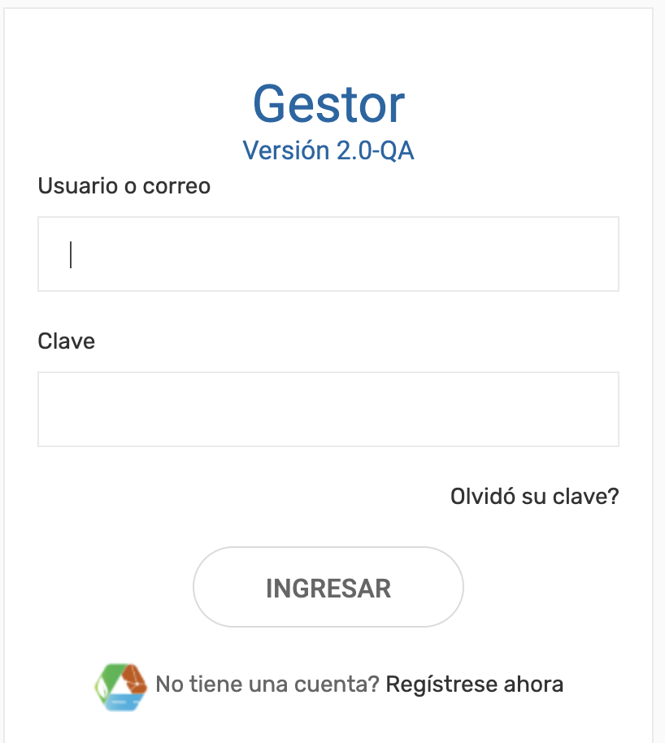
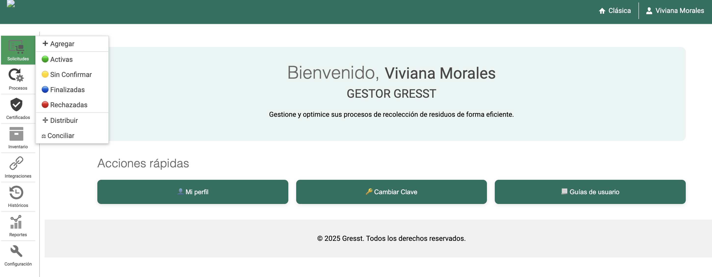
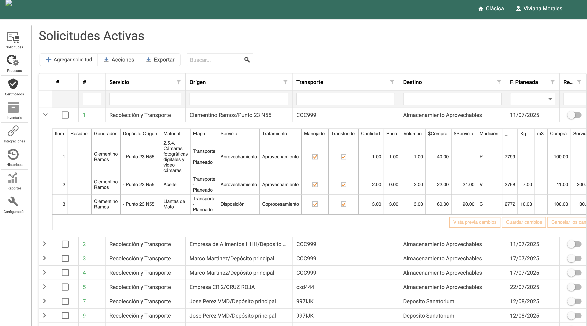
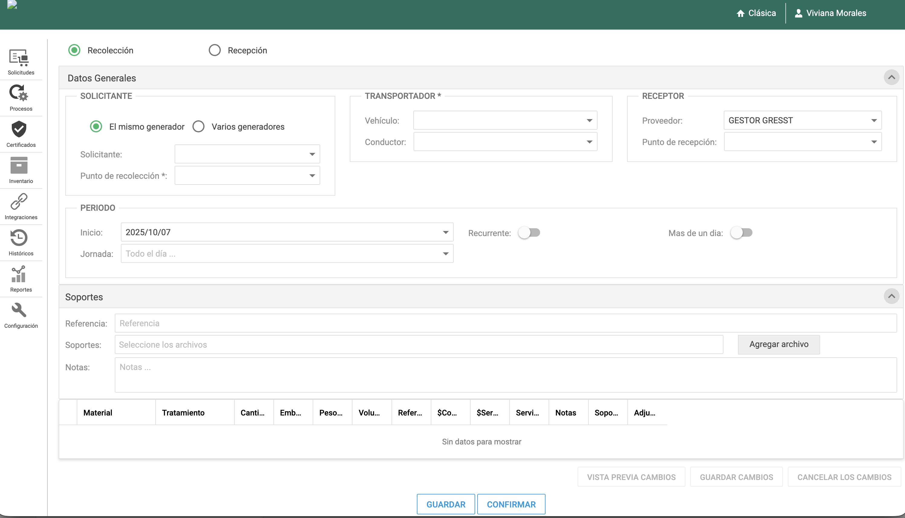
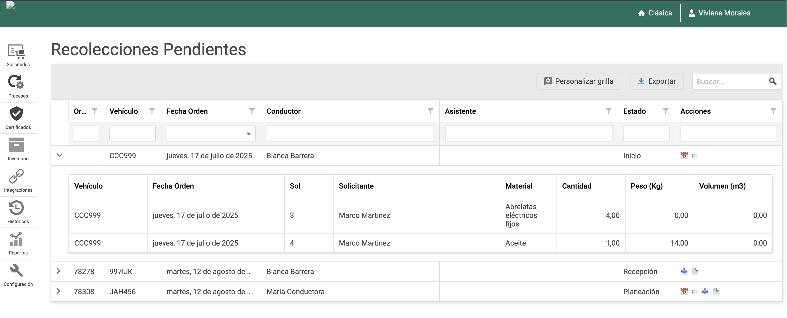

# Guía del Portal de Gestores

## Introducción

El Portal de Gestores es la interfaz principal para empresas que administran la recolección y tratamiento de residuos. Esta guía te ayudará a navegar y utilizar todas las funcionalidades disponibles.

---

## Acceso al Portal

### URL de Acceso
```
https://gestores.gresst.com
```

### Pantalla de Login


*Interfaz de acceso al Portal de Gestores con formulario de autenticación*

#### Componentes del Login:
- **Logo de Gresst:** Identificación visual de la plataforma
- **Título:** "Portal de Gestores" claramente identificado
- **Campos de autenticación:** Usuario y contraseña
- **Botón de acceso:** Iniciar sesión
- **Enlaces de ayuda:** Recuperar contraseña y soporte
- **Información de seguridad:** Indicadores de conexión segura

### Proceso de Login

#### Paso 1: Acceso a la plataforma
1. Abrir el navegador web
2. Navegar a `https://gestores.gresst.com`
3. Verificar que la URL muestre el candado de seguridad (HTTPS)

#### Paso 2: Ingreso de credenciales
1. **Usuario:** Ingresar el nombre de usuario asignado
   - Formato típico: `nombre.apellido` o `usuario@empresa.com`
   - No incluir espacios ni caracteres especiales
2. **Contraseña:** Ingresar la contraseña temporal o personal
   - Mínimo 8 caracteres
   - Debe incluir mayúsculas, minúsculas y números
   - Se recomienda usar caracteres especiales

#### Paso 3: Autenticación
1. Hacer clic en **"Iniciar Sesión"**
2. El sistema validará las credenciales
3. En caso de error, verificar:
   - Usuario y contraseña correctos
   - Conexión a internet activa
   - Mayúsculas/minúsculas en la contraseña

#### Paso 4: Acceso al dashboard
- Redirección automática al panel principal
- Carga del menú personalizado según permisos
- Aparición del banner de bienvenida personalizado

### Credenciales
- **Usuario:** Proporcionado por el administrador del sistema
- **Contraseña:** Temporal, debe cambiarse en el primer acceso
- **Autenticación:** Login seguro con verificación en dos pasos (opcional)

### Seguridad del Login

#### Características de seguridad:
- **Conexión HTTPS:** Todos los datos se transmiten cifrados
- **Validación de sesión:** Timeout automático por inactividad
- **Bloqueo temporal:** Después de múltiples intentos fallidos
- **Auditoría:** Registro de accesos y actividades

#### Recomendaciones:
- ✅ **Nunca compartir** credenciales con otros usuarios
- ✅ **Cerrar sesión** al terminar el trabajo
- ✅ **Cambiar contraseña** periódicamente
- ✅ **No usar** en computadoras públicas
- ✅ **Reportar** accesos no autorizados inmediatamente

### Solución de Problemas de Login

#### Problemas comunes y soluciones:

##### 🔒 **"Usuario o contraseña incorrectos"**
**Posibles causas:**
- Credenciales mal escritas
- Mayúsculas/minúsculas incorrectas
- Cuenta bloqueada por intentos fallidos

**Soluciones:**
1. Verificar escritura exacta del usuario
2. Comprobar estado de mayúsculas (Caps Lock)
3. Contactar administrador para desbloquear cuenta
4. Solicitar restablecimiento de contraseña

##### 🌐 **"Error de conexión"**
**Posibles causas:**
- Problemas de internet
- Servidor temporalmente no disponible
- Firewall bloqueando el acceso

**Soluciones:**
1. Verificar conexión a internet
2. Intentar nuevamente en unos minutos
3. Contactar soporte técnico
4. Verificar configuración de firewall corporativo

##### ⏰ **"Sesión expirada"**
**Posibles causas:**
- Inactividad prolongada
- Cambio de IP durante la sesión
- Configuración de seguridad del servidor

**Soluciones:**
1. Hacer login nuevamente
2. Evitar inactividad prolongada
3. No cambiar de red durante el trabajo
4. Configurar notificaciones de sesión

##### 🔐 **"Cuenta bloqueada"**
**Posibles causas:**
- Múltiples intentos fallidos de login
- Actividad sospechosa detectada
- Política de seguridad de la empresa

**Soluciones:**
1. Contactar administrador del sistema
2. Esperar tiempo de desbloqueo automático
3. Verificar que no haya acceso no autorizado
4. Revisar logs de actividad

### Recuperación de Contraseña

#### Proceso para recuperar contraseña:

1. **Acceder al enlace:** "¿Olvidaste tu contraseña?"
2. **Ingresar usuario:** Escribir nombre de usuario registrado
3. **Verificación:** El sistema enviará instrucciones por email
4. **Seguir enlace:** Abrir email y hacer clic en enlace de recuperación
5. **Nueva contraseña:** Crear nueva contraseña segura
6. **Confirmar:** Volver a ingresar la nueva contraseña
7. **Login:** Acceder con las nuevas credenciales

#### Requisitos para nueva contraseña:
- **Mínimo 8 caracteres**
- **Al menos una mayúscula**
- **Al menos una minúscula**
- **Al menos un número**
- **Caracteres especiales recomendados:** `!@#$%^&*`

---

## Estructura de la Interfaz

### Layout Principal


*Interfaz principal del Portal de Gestores mostrando la estructura de navegación*

#### Componentes del Layout:
- **Header Superior (Verde):** Logo, notificaciones, usuario logueado y configuración
- **Menú Lateral (Izquierda):** Navegación principal con 8 secciones
- **Área de Contenido (Centro-Derecha):** Panel principal donde se muestra la información
- **Banner de Bienvenida:** Mensaje personalizado para el usuario
- **Acciones Rápidas:** Accesos directos a funciones comunes

---

## Menú Principal

El menú lateral izquierdo contiene todas las funcionalidades organizadas por categorías:

### 📋 **Solicitudes**

**Descripción:** Centro de control para todas las solicitudes de recolección.


*Panel de solicitudes mostrando órdenes pendientes y en proceso de recolección*

#### Vista de Solicitudes Activas

La pantalla de solicitudes activas presenta una interfaz organizada que permite gestionar eficientemente todas las órdenes de recolección en diferentes estados:

##### 📊 **Panel de Resumen**
- **Solicitudes Pendientes:** Contador de órdenes sin asignar
- **En Proceso:** Solicitudes actualmente en ejecución
- **Completadas Hoy:** Servicios finalizados en la fecha actual
- **Alertas:** Notificaciones de urgencias o retrasos

##### 📋 **Lista de Solicitudes**
Cada solicitud muestra información clave:
- **ID de Solicitud:** Identificador único de la orden
- **Generador:** Empresa que solicita el servicio
- **Tipo de Residuo:** Clasificación del material a recolectar
- **Ubicación:** Dirección específica del punto de recolección
- **Fecha/Hora:** Programación del servicio
- **Estado:** Pendiente, Asignada, En Proceso, Completada
- **Prioridad:** Normal, Alta, Urgente
- **Acciones:** Botones para gestionar cada solicitud

##### 🔍 **Filtros y Búsqueda**
- **Filtro por Estado:** Pendientes, En Proceso, Completadas
- **Filtro por Fecha:** Rango personalizable
- **Filtro por Tipo:** Tipo de residuo específico
- **Filtro por Ubicación:** Zona geográfica
- **Búsqueda:** Por ID, empresa o dirección

#### Funcionalidades disponibles:

##### **Nuevas Solicitudes**
- Visualizar solicitudes pendientes de asignación
- Revisar detalles completos de cada orden
- Evaluar viabilidad y recursos necesarios
- Asignar prioridades según urgencia

##### **En Proceso**
- Seguimiento en tiempo real de solicitudes asignadas
- Monitoreo de progreso de recolección
- Comunicación con conductores en campo
- Gestión de incidencias o retrasos

##### **Completadas**
- Historial de solicitudes finalizadas
- Verificación de documentación generada
- Control de calidad del servicio prestado
- Generación de certificados

##### **Canceladas**
- Registro de solicitudes canceladas o rechazadas
- Razones de cancelación
- Reprogramación si aplica
- Análisis de causas para mejora

#### Gestión de Solicitudes - Proceso Detallado

##### **Paso 1: Revisar Solicitud**
1. **Seleccionar solicitud** de la lista
2. **Expandir detalles** haciendo clic en la fila
3. **Verificar información:**
   - Ubicación exacta y coordenadas GPS
   - Tipo y cantidad de residuos
   - Fecha/hora solicitada
   - Información del generador
   - Especificaciones especiales

##### **Paso 2: Evaluar Recursos**
1. **Verificar disponibilidad** de vehículos
2. **Revisar capacidad** de carga requerida
3. **Confirmar disponibilidad** de conductores
4. **Evaluar tiempo estimado** de servicio
5. **Considerar restricciones** de tráfico o acceso

##### **Paso 3: Asignar Servicio**
1. **Seleccionar vehículo** apropiado
2. **Asignar conductor** disponible
3. **Establecer fecha/hora** de recolección
4. **Agregar notas** o instrucciones especiales
5. **Confirmar asignación**

##### **Paso 4: Seguimiento**
1. **Monitorear progreso** en tiempo real
2. **Comunicarse con conductor** si es necesario
3. **Actualizar estado** según avance
4. **Gestionar incidencias** si ocurren
5. **Confirmar finalización**

#### Estados de Solicitudes

| Estado | Descripción | Acciones Disponibles |
|--------|-------------|---------------------|
| **🟡 Pendiente** | Solicitud recibida, sin asignar | Asignar, Cancelar, Reprogramar |
| **🔵 Asignada** | Vehículo y conductor asignados | Modificar, Cancelar, Iniciar |
| **🟢 En Proceso** | Recolección en ejecución | Monitorear, Completar, Reportar |
| **✅ Completada** | Servicio finalizado exitosamente | Verificar, Generar certificado |
| **❌ Cancelada** | Solicitud cancelada o rechazada | Reprogramar, Archivar |

#### Acciones Rápidas

##### **Botones de Acción en Cada Fila:**
- **👁️ Ver:** Consultar detalles completos
- **✏️ Editar:** Modificar información de la solicitud
- **🚚 Asignar:** Asignar vehículo y conductor
- **📞 Contactar:** Comunicarse con el generador
- **📋 Duplicar:** Crear solicitud similar
- **🗑️ Cancelar:** Cancelar la solicitud

##### **Acciones Masivas:**
- **Seleccionar múltiples:** Usar checkboxes para selección múltiple
- **Asignar en lote:** Asignar varias solicitudes a un mismo vehículo
- **Exportar:** Generar reporte de solicitudes seleccionadas
- **Cambiar estado:** Modificar estado de múltiples solicitudes

#### Consejos para Uso Eficiente

##### **Organización de Solicitudes:**
1. **Ordenar por prioridad:** Ver primero las solicitudes urgentes
2. **Filtrar por estado:** Enfocarse en un tipo de solicitud a la vez
3. **Usar búsqueda rápida:** Localizar solicitudes específicas por ID
4. **Agrupar por zona:** Planificar rutas eficientes por ubicación

##### **Gestión de Tiempo:**
- **Revisar pendientes** cada 15-30 minutos
- **Asignar solicitudes** en bloques de tiempo
- **Monitorear en proceso** durante horarios críticos
- **Actualizar estados** inmediatamente después de cambios

##### **Atajos de Teclado:**
- **Ctrl + F:** Abrir búsqueda rápida
- **Ctrl + A:** Seleccionar todas las solicitudes visibles
- **F5:** Actualizar lista de solicitudes
- **Enter:** Ver detalles de solicitud seleccionada
- **Esc:** Cerrar ventanas emergentes

##### **Indicadores Visuales:**
- **🟡 Amarillo:** Solicitudes pendientes (requieren atención)
- **🔵 Azul:** Solicitudes asignadas (en espera de inicio)
- **🟢 Verde:** Solicitudes en proceso (monitorear)
- **✅ Verde con check:** Solicitudes completadas (verificar)
- **❌ Rojo:** Solicitudes canceladas o con problemas

#### Formulario de Solicitud - Agregar/Editar


*Pantalla para crear nuevas solicitudes o editar solicitudes existentes*

##### **Información General de la Solicitud**

El formulario de solicitud está organizado en secciones lógicas para facilitar el llenado y evitar errores:

###### **📋 Datos Básicos**
- **ID de Solicitud:** Generado automáticamente (solo lectura en edición)
- **Fecha de Creación:** Automática al crear nueva solicitud
- **Usuario Creador:** Sistema asigna automáticamente
- **Estado:** Pendiente (por defecto), modifiable según flujo
- **Prioridad:** 
  - 🟢 Normal
  - 🟡 Alta
  - 🔴 Urgente

###### **🏢 Información del Generador**
- **Empresa Generadora:** Lista desplegable de empresas registradas
- **Contacto Principal:** Persona responsable del servicio
- **Teléfono de Contacto:** Para coordinación directa
- **Email de Contacto:** Para notificaciones y documentos
- **Código Cliente:** Identificador único del generador

###### **📍 Ubicación de Recolección**
- **Dirección Completa:** Campo de texto libre para dirección
- **Coordenadas GPS:** Generadas automáticamente por geocodificación
- **Zona/Ciudad:** Clasificación geográfica
- **Referencias:** Instrucciones adicionales para ubicación
- **Restricciones de Acceso:** Horarios, vehículos permitidos, etc.
- **Mapa:** Visualización interactiva para verificar ubicación

###### **🗑️ Información de Residuos**
- **Tipo de Residuo:** Lista desplegable con categorías:
  - Residuos Peligrosos
  - Residuos No Peligrosos
  - Residuos Orgánicos
  - Residuos Inorgánicos
  - Residuos Especiales
- **Subcategoría:** Clasificación específica del material
- **Cantidad Estimada:** 
  - Valor numérico
  - Unidad de medida (kg, litros, m³, unidades)
- **Estado Físico:** Sólido, Líquido, Gaseoso, Semisólido
- **Descripción Detallada:** Características específicas del material

###### **📅 Programación del Servicio**
- **Fecha Solicitada:** Calendario para seleccionar fecha
- **Hora Preferida:** Rango de horario deseado
- **Hora Inicio:** Hora exacta de inicio del servicio
- **Hora Fin:** Hora estimada de finalización
- **Duración Estimada:** Calculada automáticamente
- **Recurrencia:** Una vez, Diaria, Semanal, Mensual

###### **🚚 Asignación de Recursos**
- **Vehículo Asignado:** Lista de vehículos disponibles
- **Conductor Asignado:** Lista de conductores disponibles
- **Capacidad Requerida:** Verificación automática con vehículo
- **Equipos Especiales:** Herramientas o equipos adicionales
- **Personal Adicional:** Ayudantes o especialistas requeridos

###### **📝 Notas y Observaciones**
- **Instrucciones Especiales:** Detalles específicos del servicio
- **Requerimientos de Seguridad:** Medidas de protección necesarias
- **Documentación Requerida:** Certificados o permisos especiales
- **Observaciones Internas:** Notas para el equipo de gestión

##### **Proceso de Creación de Solicitud**

###### **Paso 1: Información Básica**
1. **Seleccionar empresa generadora** de la lista
2. **Verificar datos de contacto** (se cargan automáticamente)
3. **Establecer prioridad** según urgencia del servicio
4. **Agregar fecha solicitada** usando el calendario

###### **Paso 2: Ubicación**
1. **Ingresar dirección completa** en el campo de texto
2. **Verificar coordenadas GPS** en el mapa
3. **Agregar referencias** para facilitar ubicación
4. **Revisar restricciones** de acceso si aplican

###### **Paso 3: Residuos**
1. **Seleccionar tipo de residuo** principal
2. **Elegir subcategoría** específica
3. **Indicar cantidad y unidad** de medida
4. **Describir características** adicionales

###### **Paso 4: Programación**
1. **Confirmar fecha** de recolección
2. **Establecer horario** preferido
3. **Verificar disponibilidad** de recursos
4. **Ajustar duración** si es necesario

###### **Paso 5: Asignación**
1. **Seleccionar vehículo** apropiado
2. **Asignar conductor** disponible
3. **Verificar capacidad** y compatibilidad
4. **Agregar equipos** especiales si se requieren

###### **Paso 6: Revisión y Confirmación**
1. **Revisar todos los datos** ingresados
2. **Verificar validaciones** del sistema
3. **Agregar observaciones** finales
4. **Guardar solicitud** o enviar para aprobación

##### **Validaciones del Sistema**

###### **Validaciones Automáticas:**
- **Coordenadas GPS válidas** para la dirección ingresada
- **Disponibilidad de vehículo** en la fecha/hora seleccionada
- **Capacidad del vehículo** suficiente para la cantidad de residuos
- **Conductor disponible** en el horario programado
- **Datos de contacto** completos y válidos

###### **Validaciones de Negocio:**
- **Tipo de residuo compatible** con el vehículo asignado
- **Horarios de trabajo** del conductor y vehículo
- **Restricciones de tráfico** en la zona y horario
- **Permisos requeridos** para el tipo de residuo

##### **Acciones Disponibles**

###### **Botones del Formulario:**
- **💾 Guardar:** Guardar borrador sin enviar
- **📤 Enviar:** Crear solicitud y enviar para procesamiento
- **❌ Cancelar:** Descartar cambios y volver
- **👁️ Vista Previa:** Ver cómo se verá la solicitud
- **📋 Duplicar:** Crear solicitud similar
- **🗑️ Eliminar:** Borrar solicitud (solo si no está en proceso)

###### **Acciones de Edición:**
- **✏️ Editar:** Modificar solicitud existente
- **📝 Agregar Nota:** Añadir observación o comentario
- **📎 Adjuntar:** Subir documentos relacionados
- **📞 Contactar:** Enviar mensaje al generador
- **🔄 Cambiar Estado:** Modificar estado de la solicitud

##### **Consejos para Llenar el Formulario**

###### **Mejores Prácticas:**
1. **Completar campos obligatorios** antes de guardar
2. **Verificar dirección** usando el mapa interactivo
3. **Usar descripciones específicas** para residuos
4. **Establecer horarios realistas** considerando tráfico
5. **Agregar observaciones detalladas** para casos especiales

###### **Campos Críticos:**
- **Dirección exacta:** Fundamental para ubicación correcta
- **Tipo de residuo:** Determina vehículo y proceso requerido
- **Cantidad:** Afecta selección de vehículo y tiempo estimado
- **Horario:** Debe considerar disponibilidad de recursos
- **Contacto:** Esencial para coordinación del servicio

###### **Errores Comunes a Evitar:**
- ❌ **Direcciones incompletas** o con errores tipográficos
- ❌ **Cantidades incorrectas** que generen sobrecarga
- ❌ **Horarios imposibles** o fuera de disponibilidad
- ❌ **Tipo de residuo incorrecto** que cause incompatibilidad
- ❌ **Datos de contacto inexactos** que impidan coordinación

---

### 🔄 **Procesos**

**Descripción:** Monitoreo y gestión de flujos de trabajo operativos.

#### Transportes Pendientes


*Vista de transportes pendientes mostrando la gestión de rutas y vehículos en proceso*

##### **Gestión de Transportes**

La sección de Procesos/Transporte permite supervisar y gestionar todos los transportes de residuos desde su asignación hasta su finalización:

###### **📊 Panel de Control de Transportes**
- **Transportes Pendientes:** Solicitudes asignadas esperando inicio
- **En Proceso:** Transportes actualmente en ejecución
- **Completados Hoy:** Servicios finalizados en la fecha actual
- **Retrasados:** Transportes que excedieron el tiempo estimado
- **Alertas:** Notificaciones de incidencias o problemas

###### **🚚 Lista de Transportes**
Cada transporte muestra información detallada:
- **ID de Transporte:** Identificador único del proceso
- **Vehículo:** Tipo y capacidad del vehículo asignado
- **Conductor:** Nombre del conductor responsable
- **Ruta:** Origen y destino del transporte
- **Estado:** Pendiente, En Proceso, En Ruta, Completado
- **Progreso:** Porcentaje de avance del transporte
- **Tiempo Estimado:** Duración prevista del servicio
- **Acciones:** Botones para gestionar cada transporte

###### **🗺️ Visualización de Rutas**
- **Mapa Interactivo:** Vista geográfica de todas las rutas
- **Puntos de Recolección:** Ubicaciones marcadas en el mapa
- **Trayectoria GPS:** Ruta optimizada para cada vehículo
- **Estado en Tiempo Real:** Posición actual de cada vehículo
- **Tráfico:** Información de congestión vehicular

#### Funcionalidades del Módulo Transporte

##### **📋 Planificación de Rutas**
- **Optimización Automática:** Algoritmos para rutas eficientes
- **Asignación de Vehículos:** Selección automática según capacidad
- **Agrupación Geográfica:** Agrupar recolecciones por zona
- **Estimación de Tiempo:** Cálculo basado en distancia y tráfico
- **Validación de Restricciones:** Verificar limitaciones de acceso

##### **🚛 Gestión de Vehículos**
- **Estado de Flota:** Disponibilidad y ubicación de vehículos
- **Capacidad de Carga:** Control de peso y volumen máximo
- **Mantenimiento:** Programación de servicios preventivos
- **Combustible:** Monitoreo de consumo y nivel
- **Documentación:** Licencias, seguros y permisos vigentes

##### **👨‍💼 Gestión de Conductores**
- **Disponibilidad:** Horarios y días de trabajo
- **Licencias:** Verificación de permisos de manejo
- **Capacitación:** Certificaciones y entrenamientos
- **Rendimiento:** Métricas de eficiencia y puntualidad
- **Comunicación:** Canales de contacto directo

##### **⏰ Monitoreo en Tiempo Real**
- **Seguimiento GPS:** Posición actual de cada vehículo
- **Progreso de Ruta:** Avance en tiempo real
- **Alertas Automáticas:** Notificaciones de incidencias
- **Comunicación Bidireccional:** Chat con conductores
- **Actualización de Estados:** Cambios automáticos según progreso

#### Estados de Transporte

| Estado | Descripción | Acciones Disponibles |
|--------|-------------|---------------------|
| **🟡 Pendiente** | Transporte asignado, sin iniciar | Iniciar, Modificar, Cancelar |
| **🔵 En Cola** | Esperando turno de salida | Priorizar, Reprogramar |
| **🟢 En Proceso** | Transporte iniciado | Monitorear, Completar |
| **🚛 En Ruta** | Vehículo en camino | Seguir, Contactar |
| **✅ Completado** | Transporte finalizado | Verificar, Generar certificado |
| **❌ Retrasado** | Excede tiempo estimado | Investigar, Reasignar |
| **⚠️ Con Problemas** | Incidencia reportada | Resolver, Escalar |

#### Proceso de Gestión de Transportes

##### **Paso 1: Asignación**
1. **Seleccionar solicitudes** para transportar
2. **Verificar disponibilidad** de vehículos y conductores
3. **Planificar ruta óptima** usando algoritmos
4. **Asignar recursos** (vehículo + conductor)
5. **Confirmar programación** y horarios

##### **Paso 2: Inicio del Transporte**
1. **Verificar preparación** del vehículo
2. **Confirmar presencia** del conductor
3. **Validar documentación** requerida
4. **Iniciar seguimiento GPS**
5. **Notificar inicio** al generador

##### **Paso 3: Monitoreo**
1. **Seguir progreso** en tiempo real
2. **Verificar cumplimiento** de ruta
3. **Responder a alertas** o incidencias
4. **Mantener comunicación** con conductor
5. **Actualizar estados** según avance

##### **Paso 4: Finalización**
1. **Confirmar llegada** al destino
2. **Verificar descarga** completa
3. **Obtener evidencia** fotográfica
4. **Actualizar estado** a completado
5. **Generar documentación** final

#### Alertas y Notificaciones

##### **Tipos de Alertas:**
- **🚨 Emergencia:** Accidente o problema grave
- **⏰ Retraso:** Transporte excede tiempo estimado
- **📍 Desvío:** Vehículo fuera de ruta planificada
- **⛽ Combustible:** Nivel bajo de combustible
- **🔧 Mantenimiento:** Problema mecánico reportado
- **📞 Comunicación:** Conductor no responde

##### **Canales de Notificación:**
- **Sistema interno:** Alertas en el dashboard
- **Email:** Notificaciones por correo electrónico
- **SMS:** Mensajes de texto para urgencias
- **Push notifications:** Alertas en dispositivos móviles
- **WhatsApp:** Mensajes directos al conductor

#### Optimización de Rutas

##### **Factores de Optimización:**
- **Distancia:** Minimizar kilometraje total
- **Tiempo:** Reducir duración del servicio
- **Combustible:** Optimizar consumo de gasolina
- **Tráfico:** Evitar horas pico y congestiones
- **Capacidad:** Maximizar carga por vehículo

##### **Algoritmos Utilizados:**
- **TSP (Traveling Salesman Problem):** Ruta más corta
- **VRP (Vehicle Routing Problem):** Múltiples vehículos
- **Machine Learning:** Aprendizaje de patrones históricos
- **Real-time Traffic:** Integración con datos de tráfico
- **Weather Integration:** Consideración de condiciones climáticas

#### Reportes y Analytics

##### **Métricas de Rendimiento:**
- **Tiempo promedio** por transporte
- **Kilometraje total** por vehículo
- **Eficiencia de rutas** (tiempo real vs estimado)
- **Consumo de combustible** por vehículo
- **Puntualidad** de conductores

##### **Reportes Disponibles:**
- **Reporte diario:** Resumen de transportes del día
- **Reporte semanal:** Análisis de rendimiento semanal
- **Reporte mensual:** Estadísticas de eficiencia mensual
- **Reporte por conductor:** Rendimiento individual
- **Reporte por vehículo:** Utilización de flota

#### Consejos para Gestión Eficiente

##### **Mejores Prácticas:**
1. **Planificar con anticipación** las rutas del día
2. **Monitorear constantemente** el progreso de transportes
3. **Responder rápidamente** a alertas e incidencias
4. **Mantener comunicación** fluida con conductores
5. **Analizar métricas** para mejorar procesos

##### **Optimización de Recursos:**
- **Agrupar recolecciones** por zona geográfica
- **Balancear carga** entre vehículos disponibles
- **Considerar horarios** de tráfico y restricciones
- **Planificar mantenimiento** preventivo de vehículos
- **Capacitar conductores** en rutas y procedimientos

---

---

### 🛡️ **Certificados**

**Descripción:** Generación y administración de documentación legal.

#### Tipos de certificados:
- **Certificado de Disposición Final:** Documento oficial de tratamiento
- **Manifiesto de Transporte:** Documentación de traslado de residuos
- **Certificado de Cumplimiento:** Verificación normativa
- **Reportes Ambientales:** Documentos para autoridades

#### Proceso de generación:
1. Seleccionar tipo de certificado
2. Asociar con solicitud/completado
3. Completar información requerida
4. Generar documento
5. Enviar al generador por email

---

### 📦 **Inventario**

**Descripción:** Control de recursos y existencias.

#### Módulos disponibles:
- **Residuos Recolectados:** Registro por tipo y cantidad
- **Materiales:** Control de suministros y equipos
- **Almacenes:** Gestión de centros de acopio
- **Alertas:** Notificaciones de stock mínimo

#### Gestión de inventario:
- **Entradas:** Registro de residuos recibidos
- **Salidas:** Registro de materiales procesados
- **Transferencias:** Movimientos entre almacenes
- **Reportes:** Estados de inventario y valorización

---

### 🔗 **Integraciones**

**Descripción:** Configuración de conexiones con sistemas externos.

#### Integraciones disponibles:
- **Sistemas ERP:** SAP, Oracle, Dynamics
- **GPS y Mapas:** Google Maps, OpenStreetMap
- **Facturación:** Sistemas de cobro automático
- **Comunicaciones:** WhatsApp Business, SMS

#### Configuración de integraciones:
1. Acceder a configuración de integración
2. Seleccionar sistema a conectar
3. Proporcionar credenciales y parámetros
4. Realizar prueba de conexión
5. Activar sincronización automática

---

### 📊 **Históricos**

**Descripción:** Acceso a registros históricos y auditoría.

#### Consultas disponibles:
- **Operaciones por Período:** Filtrado por fechas
- **Trazabilidad de Residuos:** Seguimiento completo del ciclo
- **Actividades de Usuario:** Log de acciones realizadas
- **Reportes Históricos:** Exportación de datos

#### Filtros avanzados:
- **Rango de fechas:** Desde/hasta específico
- **Tipo de residuo:** Filtro por clasificación
- **Ubicación:** Por zona geográfica
- **Usuario:** Actividades por responsable

---

### 📈 **Reportes**

**Descripción:** Generación de informes analíticos y estadísticos.

#### Tipos de reportes:
- **Operacionales:** Rendimiento diario, semanal, mensual
- **Financieros:** Costos, ingresos, rentabilidad
- **Ambientales:** Impacto y cumplimiento normativo
- **Eficiencia:** Métricas de productividad

#### Generación de reportes:
1. Seleccionar tipo de reporte
2. Definir período de análisis
3. Aplicar filtros específicos
4. Configurar formato de salida
5. Generar y descargar documento

---

### ⚙️ **Configuración**

**Descripción:** Administración del sistema y personalización.

#### Áreas de configuración:
- **Perfiles de Usuario:** Roles y permisos
- **Parámetros del Sistema:** Configuración general
- **Notificaciones:** Preferencias de alertas
- **Mantenimiento:** Respaldos y actualizaciones

#### Gestión de usuarios:
1. Crear nuevo usuario
2. Asignar rol y permisos
3. Configurar perfil y preferencias
4. Activar cuenta
5. Enviar credenciales de acceso

---

## Flujo de Trabajo Típico

### Proceso diario de gestión:

1. **Revisar Solicitudes** 📋
   - Acceder a nuevas solicitudes
   - Evaluar prioridades y recursos
   - Asignar a vehículos disponibles

2. **Monitorear Procesos** 🔄
   - Supervisar ejecución en tiempo real
   - Responder a alertas o incidencias
   - Ajustar rutas según necesidades

3. **Gestionar Inventario** 📦
   - Actualizar registros de recolección
   - Controlar existencias de materiales
   - Generar alertas de stock

4. **Emitir Certificados** 🛡️
   - Procesar certificados de servicios completados
   - Enviar documentación a generadores
   - Archivar para cumplimiento legal

5. **Revisar Reportes** 📈
   - Analizar rendimiento del día
   - Identificar áreas de mejora
   - Planificar optimizaciones

---

## Consejos de Uso

### Mejores Prácticas:

1. **Organización:** Utiliza filtros y búsquedas para encontrar información rápidamente
2. **Notificaciones:** Mantén activadas las alertas importantes
3. **Respaldos:** Realiza respaldos regulares de datos críticos
4. **Capacitación:** Asegúrate de que todo el equipo esté capacitado
5. **Actualizaciones:** Mantén el sistema actualizado con las últimas versiones

### Atajos de Teclado:
- **Ctrl + N:** Nueva solicitud
- **Ctrl + F:** Buscar
- **Ctrl + R:** Actualizar vista
- **Ctrl + S:** Guardar cambios
- **Esc:** Cerrar ventanas emergentes

---

## Soporte y Ayuda

### Recursos disponibles:
- **Manual de Usuario:** Documentación detallada
- **Videos Tutoriales:** Guías paso a paso
- **Soporte Técnico:** Canal directo con especialistas
- **FAQ:** Preguntas frecuentes
- **Chat en Vivo:** Asistencia inmediata

### Contacto:
- **Email:** soporte@gestores.gresst.com
- **Teléfono:** +1 (555) 123-4567
- **Horario:** Lunes a Viernes, 8:00 AM - 6:00 PM
- **Chat:** Disponible en la interfaz del portal

---

## Versión

**Última actualización:** Octubre 2025  
**Versión de la guía:** 1.0  
**Compatibilidad:** Portal de Gestores v2.1+
